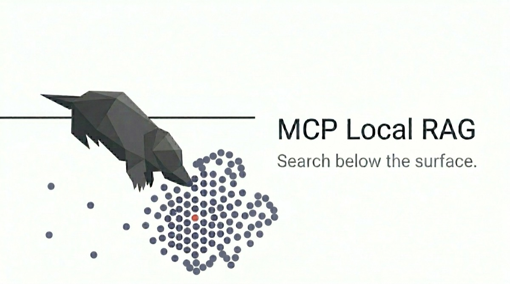

<p align="center">
  
</p>

# MCP Local RAG

[](https://github.com/shinpr/mcp-local-rag)
[](https://www.npmjs.com/package/mcp-local-rag)
[](https://opensource.org/licenses/MIT)
[](https://registry.modelcontextprotocol.io/)

<p align="center">
  <a href="README.md">English</a> |
  <a href="README.zh-CN.md">简体中文</a> |
  <a href="README.de.md">Deutsch</a> |
  <a href="README.es.md">Español</a> |
  <a href="README.pt-BR.md">Português (Brasil)</a> |
  <strong>Français</strong>
</p>

Recherchez dans des documents confidentiels depuis un client MCP ou un terminal, sans les envoyer à une API d'embeddings.

mcp-local-rag indexe les fichiers PDF, DOCX et Markdown ainsi que les fichiers texte sur votre machine. La recherche associe similarité sémantique et correspondance par mots-clés. Elle tient ainsi compte du sens de la requête comme des termes techniques exacts, tels que les noms d'API, de classes et les codes d'erreur.

## Fonctionnalités

- **Exécution locale :** L'analyse des documents, les embeddings, le stockage et la recherche s'effectuent sur votre machine. Une fois le modèle téléchargé, l'import de texte et la recherche fonctionnent hors ligne.
- **Recherche hybride :** La recherche sémantique trouve les concepts voisins, tandis que la correspondance par mots-clés améliore le classement des termes techniques exacts.
- **Embeddings configurables :** Choisissez un modèle d'embeddings Hugging Face adapté à la langue et au domaine de vos documents.
- **Découpage sémantique :** Les documents sont découpés aux changements de sujet plutôt qu'après un nombre fixe de caractères. Les blocs de code Markdown restent intacts.
- **MCP et CLI :** Utilisez le même index depuis un outil de programmation assisté par IA ou directement dans le terminal.

Aucune clé d'API, aucun conteneur Docker, aucune installation de Python ni aucune base de données externe ne sont nécessaires.

## Démarrage rapide

### Prérequis

- Node.js 22 ou version ultérieure
- Une connexion Internet lors de la première utilisation pour télécharger le paquet npm et le modèle d'embeddings
- Un répertoire contenant les documents à rechercher

Définissez `BASE_DIR` sur ce répertoire. Il sert également de limite de sécurité pour les opérations sur les fichiers. Remplacez `/absolute/path/to/your/documents` dans les exemples par le chemin absolu du répertoire.

mcp-local-rag utilise le protocole MCP standard via un serveur stdio local. Il fonctionne donc avec les outils de programmation assistés par IA et les autres hôtes MCP qui prennent en charge les serveurs MCP locaux.

Utilisez l'un des exemples ci-dessous, ou enregistrez `npx -y mcp-local-rag` et définissez `BASE_DIR` selon le format de configuration MCP de votre client.

**Claude Code :** Exécutez cette commande :

```bash
claude mcp add local-rag --scope user --env BASE_DIR=/absolute/path/to/your/documents -- npx -y mcp-local-rag
```

**Codex :** Ajoutez ceci à `~/.codex/config.toml` :

```toml
[mcp_servers.local-rag]
command = "npx"
args = ["-y", "mcp-local-rag"]

[mcp_servers.local-rag.env]
BASE_DIR = "/absolute/path/to/your/documents"
```

**OpenCode :** Ajoutez ceci à `~/.config/opencode/opencode.json` (ou `opencode.jsonc`) :

```json
{
  "$schema": "https://opencode.ai/config.json",
  "mcp": {
    "local-rag": {
      "type": "local",
      "command": ["npx", "-y", "mcp-local-rag"],
      "environment": {
        "BASE_DIR": "/absolute/path/to/your/documents"
      }
    }
  }
}
```

**Cursor :** Ajoutez ceci à `~/.cursor/mcp.json` :

```json
{
  "mcpServers": {
    "local-rag": {
      "command": "npx",
      "args": ["-y", "mcp-local-rag"],
      "env": {
        "BASE_DIR": "/absolute/path/to/your/documents"
      }
    }
  }
}
```

Redémarrez le client, puis demandez-lui de construire l'index :

```text
Synchronise tous les documents du répertoire racine configuré et attends la fin de l'opération.
```

La première synchronisation télécharge le modèle d'embeddings par défaut (environ 90 Mo). Une à deux minutes peuvent s'écouler avant le début de l'import. Les exécutions suivantes utilisent le cache local.

Une fois la synchronisation terminée, posez une question :

```text
Que dit la documentation de l'API au sujet de l'authentification ?
```

### Démarrage rapide avec la CLI

Pour utiliser la CLI sans client MCP :

```bash
npx mcp-local-rag ingest ./docs/
npx mcp-local-rag query "API d'authentification"
```

Par défaut, la CLI utilise le répertoire courant comme racine documentaire. Exécutez les deux commandes depuis le même répertoire pour qu'elles partagent l'index par défaut, ou définissez explicitement `BASE_DIR` et `DB_PATH`.

## Pourquoi ce projet

Certains documents ne peuvent pas être envoyés à un service d'embeddings hébergé pour des raisons de confidentialité ou de politique interne. Un index local permet de les rechercher sans ajouter de coût d'API à chaque requête.

Une recherche uniquement sémantique peut ignorer des identifiants exacts qui comptent dans la documentation technique. Le reclassement par mots-clés garde ces termes visibles sans renoncer aux requêtes en langage naturel.

## Contenu pris en charge

| Entrée | Mode d'import |
|---|---|
| PDF, DOCX, TXT, Markdown | Import d'un fichier ou synchronisation d'un répertoire |
| HTML déjà récupéré par le client | `ingest_data` ; nettoyé avec Readability puis converti en Markdown |
| Texte brut ou Markdown en mémoire | `ingest_data` avec un identifiant de source stable |

Le serveur ne récupère pas lui-même les pages HTML. Un client MCP peut charger une page et transmettre son HTML à `ingest_data`.

L'import de fichiers ne prend pas en charge Excel, PowerPoint, les images seules ni les extensions de code source. Les PDF peuvent éventuellement utiliser un modèle visuel local pour décrire les figures, mais cette fonction n'est ni un OCR ni un moteur de recherche d'images.

## Outils MCP

| Outil | Rôle |
|---|---|
| `sync_start` | Synchroniser l'index avec toutes les racines configurées ou avec un chemin précis |
| `sync_status` | Consulter l'état d'une synchronisation en cours |
| `ingest_file` | Importer ou remplacer un fichier |
| `ingest_data` | Importer du texte, du Markdown ou du HTML déjà présent dans le client |
| `query_documents` | Rechercher avec correspondance sémantique et renforcement des mots-clés |
| `read_chunk_neighbors` | Lire les segments voisins d'un résultat de recherche |
| `list_files` | Afficher les fichiers pris en charge et leur état d'import |
| `delete_file` | Supprimer un fichier indexé ou un élément `ingest_data` |
| `status` | Afficher l'état de l'index et de la recherche |

### Synchroniser une racine documentaire

`sync_start` importe les fichiers nouveaux ou modifiés, ignore ceux qui sont identiques octet par octet et retire de l'index les fichiers qui n'existent plus :

```text
Synchronise tout le contenu des racines documentaires configurées et attends la fin de l'opération.
```

L'outil renvoie immédiatement un `jobId`. Le client doit interroger `sync_status` jusqu'à ce que son état passe à `succeeded` ou `failed`. Le mode visuel n'est pas disponible pendant une synchronisation ; les PDF modifiés sont importés comme texte.

Le processus serveur ne conserve qu'une tâche de synchronisation. Une nouvelle tâche remplace l'enregistrement d'une tâche terminée, et le redémarrage du serveur efface cet enregistrement.

### Importer un fichier

`ingest_file` accepte les fichiers PDF, DOCX, TXT et Markdown. Les chemins transmis par MCP doivent être absolus et rester dans une racine documentaire configurée :

```text
Importe le document /Users/me/docs/api-spec.pdf.
```

Réimporter le même chemin remplace les segments existants.

### Rechercher et lire davantage de contexte

```text
Que dit la documentation de l'API au sujet de l'authentification ?
Trouve le comportement documenté de ERR_CONNECTION_REFUSED.
```

Les résultats contiennent le texte, le chemin source, le titre, l'indice du segment et le score de pertinence. Pour obtenir plus de contexte, transmettez à `read_chunk_neighbors` le `chunkIndex` et le `filePath` ou la `source` du résultat :

```text
Lis les segments voisins de ce résultat sur l'authentification.
```

`query_documents` et `list_files` acceptent un préfixe de chemin absolu facultatif dans `scope`, ou une liste de préfixes. Un préfixe correspond au chemin exact et à tous ses descendants.

### Importer du HTML

Utilisez `ingest_data` après que le client MCP a récupéré la page :

```text
Récupère https://example.com/docs et importe le HTML.
```

Le serveur extrait l'article principal, le convertit en Markdown et l'enregistre sous l'identifiant de source fourni. Réutiliser la même source met à jour le contenu existant.

Respectez les conditions du site source et les droits d'auteur lors de l'indexation de contenu externe.

### Figures dans les PDF

Le mode visuel ajoute une description générée aux pages PDF riches en figures. Il est facultatif et ne charge aucun modèle visuel pendant un import normal.

```text
Importe /Users/me/docs/research-paper.pdf avec visual: true.
```

```bash
npx mcp-local-rag ingest ./docs/research-paper.pdf --visual
```

| Profil | Cache du modèle | Usage |
|---|---:|---|
| `fast` (par défaut) | environ 250 Mo | Indexation visuelle légère |
| `quality` | environ 2,9 Go | Figures contenant des libellés, des annotations ou d'autres textes intégrés à l'image |

Sélectionnez le modèle le plus volumineux avec `visualQuality: "quality"` via MCP ou `--visual-quality quality` via la CLI. Lors des mesures sur CPU, l'inférence a pris environ deux fois plus de temps qu'avec `fast`, mais le résultat dépend du matériel et des mises à jour du modèle.

Les descriptions sont des textes auxiliaires, pas des transcriptions fidèles. Considérez les descriptions et le texte extrait des documents comme des entrées non fiables, et non comme des instructions.

## CLI

La CLI utilise le même analyseur, le même générateur d'embeddings et le même stockage vectoriel sans client MCP :

```bash
npx mcp-local-rag ingest ./docs/
npx mcp-local-rag sync ./docs/
npx mcp-local-rag query "API d'authentification"
npx mcp-local-rag query "authentification" --scope /docs/api --scope /docs/guide
npx mcp-local-rag read-neighbors --file-path /abs/path.md --chunk-index 5
npx mcp-local-rag list
npx mcp-local-rag status
npx mcp-local-rag delete ./docs/old.pdf
npx mcp-local-rag delete --source "https://example.com/docs"
```

Les options globales comme `--db-path`, `--cache-dir` et `--model-name` précèdent la sous-commande. Les options propres à la sous-commande viennent ensuite :

```bash
npx mcp-local-rag --db-path ./my-db query "authentification"
```

Exécutez `npx mcp-local-rag --help` pour afficher la référence complète des commandes.

La CLI ne lit pas la configuration du client MCP. Définissez les mêmes variables d'environnement ou options si les deux interfaces doivent partager un index. En particulier, `MODEL_NAME` et l'option CLI `--model-name` doivent correspondre pour une base de données partagée.

## Réglage de la recherche

Le renforcement par mots-clés est activé par défaut. Pour les corpus qui nécessitent une sélection plus stricte, vous pouvez aussi configurer le regroupement par écarts de pertinence ainsi que les filtres de distance et de fichiers.

| Variable | Valeur par défaut | Description |
|----------|---------|-------------|
| `RAG_HYBRID_WEIGHT` | `0.6` | Facteur de renforcement des mots-clés (0.0–1.0). 0 désactive le reclassement par mots-clés et 1 applique le renforcement maximal. |
| `RAG_GROUPING` | non définie | `similar` conserve le premier groupe de pertinence ; `related` en conserve jusqu'à deux et utilise les écarts importants de distance vectorielle comme limites. |
| `RAG_MAX_DISTANCE` | non définie | Écarte les résultats peu pertinents, par exemple avec `0.5`. |
| `RAG_MAX_FILES` | non définie | Limite les résultats aux N fichiers les mieux classés, par exemple `1` pour le meilleur fichier uniquement. |

Pour les spécifications d'API et les autres documents comportant de nombreux identifiants, un poids plus élevé des mots-clés peut améliorer le classement des termes exacts :

```json
"env": {
  "RAG_HYBRID_WEIGHT": "0.7"
}
```

- `0.7` : reclassement des termes exacts légèrement plus fort que la valeur par défaut
- `1.0` : renforcement maximal des mots-clés

## Fonctionnement

Pendant l'import :

1. L'analyseur extrait le texte du format d'entrée.
2. Le découpage sémantique repère les changements de sujet et conserve les blocs de code Markdown.
3. Transformers.js crée les embeddings localement.
4. LanceDB stocke les segments, les métadonnées, les vecteurs et l'index de texte intégral.

Pendant la recherche :

1. La requête est convertie en embedding avec le même modèle.
2. La recherche vectorielle récupère les segments sémantiquement proches.
3. Les filtres de distance et les groupes de pertinence facultatifs réduisent la liste des candidats lorsqu'ils sont configurés.
4. Les correspondances en texte intégral renforcent les termes exacts de la requête.

## Agent Skills

Les [Agent Skills](https://agentskills.io/) donnent aux assistants IA des consignes pour les requêtes et les imports :

```bash
npx mcp-local-rag skills install --claude-code
npx mcp-local-rag skills install --claude-code --global
npx mcp-local-rag skills install --codex
```

Les skills installées couvrent la formulation des requêtes, l'affinage des résultats et l'import de HTML. Si une skill ne s'active pas automatiquement, demandez explicitement à l'assistant d'utiliser la skill mcp-local-rag.

## Configuration

Le serveur MCP lit les variables d'environnement. La CLI accepte les mêmes variables ainsi que les options du tableau ; les options de la CLI sont prioritaires.

| Variable d'environnement | Option CLI | Valeur par défaut | Description |
|---------------------|----------|---------|-------------|
| `BASE_DIR` | `--base-dir` | Répertoire courant | Une racine documentaire ; l'option CLI peut être répétée avec `ingest`, `list` et `sync` |
| `BASE_DIRS` | Non disponible | non définie | Tableau JSON de racines documentaires ; prioritaire sur `BASE_DIR` |
| `DB_PATH` | `--db-path` | `./lancedb/` | Emplacement de la base de données vectorielle |
| `CACHE_DIR` | `--cache-dir` | `./models/` | Répertoire du cache des modèles |
| `MODEL_NAME` | `--model-name` | `Xenova/all-MiniLM-L6-v2` | Modèle d'embeddings Hugging Face |
| `MAX_FILE_SIZE` | `--max-file-size` | `104857600` (100 Mo) | Taille maximale d'un fichier en octets |
| `CHUNK_MIN_LENGTH` | `--chunk-min-length` | `50` | Longueur minimale d'un segment en caractères (1–10000) |
| `RAG_DEVICE` | Non disponible | `cpu` | Périphérique utilisé par ONNX Runtime |
| `RAG_DTYPE` | Non disponible | `fp32` | Type de données des embeddings transmis au modèle choisi |

### Racines documentaires (`BASE_DIR` et `BASE_DIRS`)

mcp-local-rag n'autorise les opérations sur les fichiers qu'à l'intérieur des racines configurées. Pour en utiliser plusieurs, `BASE_DIRS` doit être un tableau JSON de chemins non vides :

```bash
export BASE_DIRS='["/Users/me/Documents/work","/Users/me/Projects/specs"]'
```

La configuration est résolue dans cet ordre :

1. Options CLI `--base-dir <path>` (répétables avec `ingest`, `list` et `sync`)
2. `BASE_DIRS`
3. `BASE_DIR`
4. Répertoire courant

Chaque source remplace entièrement celle de priorité inférieure, au lieu de s'y ajouter. Une configuration `BASE_DIRS` incorrecte provoque une erreur sans revenir à `BASE_DIR` ni au répertoire courant. `status` reste disponible dans MCP afin que le client puisse signaler l'erreur de configuration.

```bash
npx mcp-local-rag ingest --base-dir /Users/me/work --base-dir /Users/me/specs /Users/me/work/readme.md
npx mcp-local-rag list --base-dir /Users/me/work --base-dir /Users/me/specs
npx mcp-local-rag sync --base-dir /Users/me/work --base-dir /Users/me/specs
BASE_DIRS='["/Users/me/work","/Users/me/specs"]' npx mcp-local-rag list
```

### Stockage et modèles

`DB_PATH` et `CACHE_DIR` sont relatifs au répertoire de travail du processus par défaut. Utilisez des chemins absolus si le client MCP peut démarrer le serveur depuis différents répertoires de projet.

Définissez `MODEL_NAME` ou passez `--model-name` pour choisir un modèle d'embeddings Hugging Face adapté à la langue et au domaine de vos documents.

mcp-local-rag génère les embeddings avec un pooling moyen et une normalisation L2. Lorsque vous choisissez un modèle, vérifiez que ces réglages correspondent à sa méthode d'inférence recommandée, car le type de pooling peut influer sur la qualité de la recherche.

Modifier `MODEL_NAME`, `RAG_DEVICE` ou `RAG_DTYPE` peut rendre les vecteurs existants incompatibles. Après une modification de la configuration des embeddings, utilisez un nouveau `DB_PATH` ou supprimez l'index existant et réimportez les documents.

Un exemple de modèle disponible pour les documents en français est `sentence-transformers/paraphrase-multilingual-MiniLM-L12-v2`.

## Sécurité et exploitation

- L'accès aux fichiers est limité aux racines définies par `BASE_DIR`, `BASE_DIRS` ou l'option CLI `--base-dir`.
- Les liens symboliques qui pointent hors de toutes les racines configurées sont refusés.
- Le traitement des documents et la recherche n'effectuent plus de requêtes réseau une fois les modèles nécessaires en cache.
- Le serveur est conçu pour un seul utilisateur local et ne fournit ni authentification ni contrôle d'accès.
- Ne lancez pas plusieurs processus d'écriture CLI ou MCP sur le même `DB_PATH`. Les requêtes en lecture seule restent possibles pendant une synchronisation.
- Pour sauvegarder un index, copiez le répertoire `DB_PATH` lorsqu'aucun processus d'écriture n'est actif.

<details>
<summary><strong>Dépannage</strong></summary>

### "No results found"

Les documents doivent d'abord être importés. Exécutez `"Répertoriez tous les fichiers importés"` pour vérifier leur état.

### Échec du téléchargement du modèle

Vérifiez la connexion Internet. Si vous utilisez un proxy, contrôlez les paramètres réseau. Le modèle peut aussi être [téléchargé manuellement](https://huggingface.co/Xenova/all-MiniLM-L6-v2).

### "File too large"

La limite par défaut est de 100 Mo. Découpez le fichier ou augmentez `MAX_FILE_SIZE`.

### Requêtes lentes

Consultez le nombre de segments avec `status`. Les gros documents comportant de nombreux segments peuvent ralentir les requêtes. Envisagez de diviser les fichiers très volumineux.

### "Path outside BASE_DIR"

Le chemin doit se trouver dans l'une des racines configurées : `BASE_DIR`, une entrée de `BASE_DIRS` ou un chemin fourni avec `--base-dir` dans la CLI. Utilisez un chemin absolu.

### "BASE_DIRS must be a JSON array..."

`BASE_DIRS` accepte un tableau JSON comportant un ou plusieurs chemins non vides :

- Valide : `BASE_DIRS='["/Users/me/work","/Users/me/specs"]'`
- Invalide : `BASE_DIRS=/a:/b` (la syntaxe à séparateurs n'est pas prise en charge)
- Invalide : `BASE_DIRS='[]'` (tableau vide)

### Le client MCP n'affiche pas les outils

1. Vérifiez la syntaxe du fichier de configuration
2. Quittez complètement le client, puis relancez-le (Cmd+Q sur Mac pour Cursor)
3. Testez directement : `npx mcp-local-rag` doit démarrer sans erreur

</details>

## Contribuer

Les contributions sont les bienvenues. Consultez [CONTRIBUTING.md](CONTRIBUTING.md) pour préparer l'environnement et connaître les règles du projet.

## Licence

Licence MIT. Utilisation gratuite à des fins personnelles et commerciales.

## Articles de blog

- [Building a Local RAG for Agentic Coding](https://www.norsica.jp/blog/local-rag-agentic-coding) : présentation technique du découpage sémantique et de la recherche hybride.

## Remerciements

Développé avec le [Model Context Protocol](https://modelcontextprotocol.io/) d'Anthropic, [LanceDB](https://lancedb.com/) et [Transformers.js](https://huggingface.co/docs/transformers.js).
