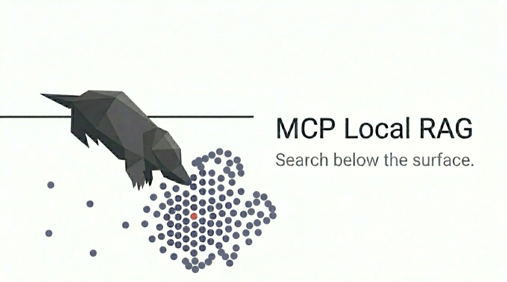

<p align="center">
  
</p>

# MCP Local RAG

[](https://github.com/shinpr/mcp-local-rag)
[](https://www.npmjs.com/package/mcp-local-rag)
[](https://opensource.org/licenses/MIT)
[](https://registry.modelcontextprotocol.io/)

<p align="center">
  <a href="README.md">English</a> |
  <a href="README.zh-CN.md">简体中文</a> |
  <a href="README.de.md">Deutsch</a> |
  <a href="README.es.md">Español</a> |
  <a href="README.pt-BR.md">Português (Brasil)</a> |
  <strong>Français</strong>
</p>

Recherchez dans des documents confidentiels depuis un client MCP ou un terminal, sans les
envoyer à une API d'embeddings.

mcp-local-rag indexe les fichiers PDF, DOCX et Markdown ainsi que les fichiers texte sur votre
machine. La recherche associe similarité sémantique et correspondance par mots-clés. Elle tient
ainsi compte du sens de la requête comme des termes techniques exacts, tels que les noms d'API,
de classes et les codes d'erreur. Les résultats contiennent des passages du document et,
lorsqu'ils sont disponibles, des titres de section et des numéros de ligne ou de page pour
consulter et citer l'original.

Aucune clé d'API, aucun conteneur Docker, aucune installation de Python ni aucune base de
données externe n'est nécessaire. Après le premier téléchargement du modèle, l'import de texte
et la recherche fonctionnent hors ligne.

## Démarrage rapide

### Prérequis

- Node.js 22 ou version ultérieure
- Une connexion Internet lors de la première utilisation pour télécharger le paquet npm et le modèle d'embeddings
- Un répertoire contenant les documents à rechercher

Définissez `BASE_DIR` sur ce répertoire. Il sert également de limite de sécurité pour les
opérations sur les fichiers. Remplacez `/absolute/path/to/your/documents` dans les exemples par
le chemin absolu du répertoire.

Utilisez l'un des exemples ci-dessous, ou enregistrez `npx -y mcp-local-rag` et définissez
`BASE_DIR` selon le format de configuration MCP de votre client.

Définissez aussi `DB_PATH` et `CACHE_DIR` avec des chemins absolus. Les chemins relatifs
partent du répertoire de travail du serveur : le démarrer depuis différents projets crée un
index et un cache de modèles dans chacun.

<details>
<summary>Claude Code</summary>

Exécutez cette commande :

```bash
claude mcp add local-rag --scope user --env BASE_DIR=/absolute/path/to/your/documents -- npx -y mcp-local-rag
```

</details>

<details>
<summary>Codex</summary>

Ajoutez ceci à `~/.codex/config.toml` :

```toml
[mcp_servers.local-rag]
command = "npx"
args = ["-y", "mcp-local-rag"]

[mcp_servers.local-rag.env]
BASE_DIR = "/absolute/path/to/your/documents"
```

</details>

<details>
<summary>OpenCode</summary>

Ajoutez ceci à `~/.config/opencode/opencode.json` (ou `opencode.jsonc`) :

```json
{
  "$schema": "https://opencode.ai/config.json",
  "mcp": {
    "local-rag": {
      "type": "local",
      "command": ["npx", "-y", "mcp-local-rag"],
      "environment": {
        "BASE_DIR": "/absolute/path/to/your/documents"
      }
    }
  }
}
```

</details>

<details>
<summary>Cursor</summary>

Ajoutez ceci à `~/.cursor/mcp.json` :

```json
{
  "mcpServers": {
    "local-rag": {
      "command": "npx",
      "args": ["-y", "mcp-local-rag"],
      "env": {
        "BASE_DIR": "/absolute/path/to/your/documents"
      }
    }
  }
}
```

</details>

Redémarrez le client, puis demandez-lui de construire l'index :

```text
Synchronise tous les documents du répertoire racine configuré et attends la fin de l'opération.
```

La première synchronisation télécharge le modèle d'embeddings par défaut (environ 90 Mo). Une à
deux minutes peuvent s'écouler avant le début de l'import. Les exécutions suivantes utilisent
le cache local.

Une fois la synchronisation terminée, posez une question :

```text
Que dit la documentation de l'API au sujet de l'authentification ?
```

### Démarrage rapide avec la CLI

Pour utiliser la CLI sans client MCP :

```bash
npx mcp-local-rag ingest ./docs/
npx mcp-local-rag query "API d'authentification"
```

Par défaut, la CLI utilise le répertoire courant comme racine documentaire. Exécutez les deux
commandes depuis le même répertoire pour qu'elles partagent l'index par défaut, ou définissez
explicitement `BASE_DIR` et `DB_PATH`.

## Contenu pris en charge

| Entrée | Mode d'import |
|---|---|
| PDF, DOCX, TXT, Markdown | Import d'un fichier ou synchronisation d'un répertoire |
| HTML déjà récupéré par le client | `ingest_data` |
| Texte brut ou Markdown en mémoire | `ingest_data` avec un identifiant de source stable |

Le serveur ne récupère pas lui-même les pages HTML. Un client MCP peut charger une page et
transmettre son HTML à `ingest_data`.

L'import de fichiers ne prend pas en charge Excel, PowerPoint, les images seules ni les
extensions de code source. Les PDF peuvent éventuellement utiliser un modèle visuel local pour
décrire les figures, mais cette fonction n'est ni un OCR ni un moteur de recherche d'images.

## Utiliser l'index

Synchronisez l'index après avoir ajouté, modifié ou supprimé des documents. Pour rechercher
puis lire le contexte d'un résultat, vous pouvez demander au client MCP :

```text
Cherche ce que dit la documentation sur ERR_CONNECTION_REFUSED.
Lis aussi les segments qui précèdent et suivent ce résultat.
```

Vous pouvez aussi importer un fichier seul ou du HTML déjà récupéré par le client. Pour mettre
à jour une entrée existante, réimportez le document avec le même chemin ou le même identifiant
de source. `sync` ignore les fichiers inchangés. Les chemins de fichiers MCP doivent être
absolus et rester dans une racine configurée.

Les titres de section détectés dans un PDF peuvent être incorrects. Si vous avez besoin du
titre exact, vérifiez-le sur la page d'origine.

<details>
<summary>Outils MCP</summary>

| Outil | Rôle |
|---|---|
| `sync_start` | Synchroniser l'index avec toutes les racines configurées ou avec un chemin précis |
| `sync_status` | Consulter l'état d'une synchronisation en cours |
| `ingest_file` | Importer ou remplacer un fichier |
| `ingest_data` | Importer du texte, du Markdown ou du HTML déjà présent dans le client |
| `query_documents` | Rechercher avec correspondance sémantique et renforcement des mots-clés |
| `read_chunk_neighbors` | Lire les segments voisins d'un résultat de recherche |
| `list_files` | Afficher les fichiers pris en charge et leur état d'import |
| `delete_file` | Supprimer un fichier indexé ou un élément `ingest_data` |
| `status` | Afficher l'état de l'index et de la recherche |

</details>

## CLI

La CLI permet de mettre à jour l'index, de cibler la recherche ou de retirer du contenu indexé
:

```bash
npx mcp-local-rag sync ./docs/
npx mcp-local-rag query "authentification" --scope /docs/api --scope /docs/guide
npx mcp-local-rag read-neighbors --file-path /abs/path.md --chunk-index 5
npx mcp-local-rag list
npx mcp-local-rag status
npx mcp-local-rag delete ./docs/old.pdf
npx mcp-local-rag delete --source "https://example.com/docs"
```

`ingest` importe les fichiers sélectionnés ; `sync` retire aussi de l'index les fichiers
supprimés et ignore ceux qui n'ont pas changé. Utilisez `--scope` pour limiter les résultats à
un préfixe de chemin et répétez cette option pour inclure plusieurs préfixes.

Les options globales comme `--db-path`, `--cache-dir` et `--model-name` précèdent la
sous-commande. Les options propres à la sous-commande viennent ensuite :

```bash
npx mcp-local-rag --db-path ./my-db query "authentification"
```

Exécutez `npx mcp-local-rag --help` pour afficher la référence complète des commandes.

`query` écrit ses résultats sur stdout au format JSON, la meilleure correspondance en premier,
ce qui permet de les rediriger vers un autre outil. La définition de chaque champ se trouve
dans [`docs/schema/query-output.schema.json`](docs/schema/query-output.schema.json).

Pour déplacer un projet tout en conservant son index, arrêtez le serveur MCP et les autres
processus d'écriture. Déplacez les fichiers et la base de données ensemble, sans modifier
l'arborescence, puis exécutez :

```bash
npx mcp-local-rag --db-path /new/project/lancedb relocate --from /old/project --to /new/project
```

Mettez à jour `BASE_DIR`/`BASE_DIRS`, `DB_PATH` et les autres chemins concernés dans la
configuration MCP, puis redémarrez le client.

## Agent Skills

Les [Agent Skills](https://agentskills.io/) donnent aux assistants IA des consignes pour les
requêtes et les imports :

```bash
npx mcp-local-rag skills install --claude-code
npx mcp-local-rag skills install --claude-code --global
npx mcp-local-rag skills install --codex
```

Les skills installées couvrent la formulation des requêtes, l'affinage des résultats et
l'import de HTML. Si une skill ne s'active pas automatiquement, demandez explicitement à
l'assistant d'utiliser la skill mcp-local-rag.

## Options avancées

Commencez avec les réglages par défaut. Consultez les sections suivantes pour utiliser
plusieurs racines documentaires, adapter la recherche à vos documents ou rendre les figures PDF
recherchables.

<details>
<summary>Stockage et racines documentaires</summary>

Le serveur MCP lit les variables d'environnement. La CLI accepte les variables et options
indiquées. Gardez le même `DB_PATH` si vos commandes doivent partager un index.

| Variable d'environnement | Option CLI | Valeur par défaut | Description |
|---------------------|----------|---------|-------------|
| `BASE_DIR` | `--base-dir` | Répertoire courant | Une racine documentaire ; l'option CLI peut être répétée avec `ingest`, `list` et `sync` |
| `BASE_DIRS` | Non disponible | non définie | Tableau JSON de racines documentaires ; prioritaire sur `BASE_DIR` |
| `DB_PATH` | `--db-path` | `./lancedb/` | Emplacement de la base de données vectorielle |
| `CACHE_DIR` | `--cache-dir` | `./models/` | Répertoire du cache des modèles |
| `HF_ENDPOINT` | Non disponible | `https://huggingface.co` | Adresse de téléchargement des modèles Hugging Face ; utilisez l'URL d'un miroir si les téléchargements directs sont bloqués |
| `MAX_FILE_SIZE` | `--max-file-size` | `104857600` (100 Mo) | Taille maximale d'un fichier en octets |

Les opérations sur les fichiers restent limitées aux racines configurées. Pour plusieurs
répertoires, définissez `BASE_DIRS='["/absolute/docs","/absolute/specs"]'` ou répétez l'option
CLI `--base-dir`. Priorité : racines CLI, `BASE_DIRS`, `BASE_DIR`, puis répertoire courant.
Seule la source ayant la priorité la plus élevée est retenue ; les racines des différentes
sources ne sont pas fusionnées. Un `BASE_DIRS` incorrect provoque une erreur. Les chemins
relatifs `DB_PATH` et `CACHE_DIR` partent du répertoire de travail.

</details>

<details>
<summary>Modèles et réglage de la recherche</summary>

Choisissez un modèle d'embeddings adapté à la langue et au domaine de vos documents. Comparez
les réglages avec vos questions habituelles et vérifiez les passages renvoyés. Choisissez un
modèle compatible avec le mean pooling et la normalisation L2, utilisés ici pour calculer les
embeddings.

| Variable d'environnement | Option CLI | Valeur par défaut | Description |
|---------------------|----------|---------|-------------|
| `MODEL_NAME` | `--model-name` | `Xenova/all-MiniLM-L6-v2` | Modèle d'embeddings Hugging Face |
| `CHUNK_MIN_LENGTH` | `--chunk-min-length` | `50` | Longueur minimale d'un segment ordinaire en caractères (1–10000) ; un fragment issu d'un découpage destiné à respecter la limite de tokens du modèle peut être plus court |
| `EMBED_TITLE_PREFIX` | Non disponible | `false` | Ajoute le titre du document à l'entrée utilisée pour calculer l'embedding de chaque segment |
| `EMBED_HEADING_PREFIX` | Non disponible | `false` | Ajoute la hiérarchie des titres de section à l'entrée de chaque segment, si la limite de tokens le permet |
| `RAG_DEVICE` | Non disponible | `cpu` | Périphérique utilisé par ONNX Runtime |
| `RAG_DTYPE` | Non disponible | `fp32` | Type de données des embeddings transmis au modèle choisi |

Les deux options de préfixe sont désactivées par défaut (`false`) et indépendantes. Essayez
`EMBED_TITLE_PREFIX` lorsqu'un segment a besoin du sujet général du document, ou
`EMBED_HEADING_PREFIX` lorsqu'il lui manque le sujet de sa section. Les activer ensemble
n'améliore pas toujours les résultats. Elles modifient les embeddings, pas le texte renvoyé ni
l'index par mots-clés ; le contexte de section est omis si son ajout dépasse la limite
d'entrée.

Lors d'un changement de modèle d'embeddings, créez un nouvel index dans un autre `DB_PATH`. Les
vecteurs de modèles différents ne sont pas comparables, même s'ils ont la même dimension. Après
un changement de `RAG_DTYPE` ou d'option de préfixe, réimportez tous les documents indexés
avant de lancer une recherche. `sync` ignore les fichiers inchangés.

La CLI ne lit pas la configuration du client MCP. Pour partager un index, utilisez le même
modèle, le même `RAG_DTYPE` et les mêmes réglages de préfixe lors de l'import et de la
recherche. Changer uniquement `RAG_DEVICE` ne nécessite pas de nouvel index.

### Réglage de la recherche

Les quatre premiers réglages du tableau s'appliquent à MCP et à la CLI. Pour donner plus de
poids aux termes exacts, essayez d'augmenter `RAG_HYBRID_WEIGHT` et comparez les résultats avec
vos propres questions. Le reclassement externe est réservé à MCP.

| Variable | Valeur par défaut | Description |
|----------|---------|-------------|
| `RAG_HYBRID_WEIGHT` | `0.6` | Facteur de renforcement des mots-clés (0.0–1.0). 0 désactive le reclassement par mots-clés et 1 applique le renforcement maximal. |
| `RAG_GROUPING` | non définie | `similar` conserve le premier groupe de pertinence ; `related` en conserve jusqu'à deux et utilise les écarts importants de distance vectorielle comme limites. |
| `RAG_MAX_DISTANCE` | non définie | Écarte les résultats peu pertinents, par exemple avec `0.5`. |
| `RAG_MAX_FILES` | non définie | Limite les résultats aux N fichiers les mieux classés, par exemple `1` pour le meilleur fichier uniquement. |
| `RAG_RERANK_CMD` | non définie | MCP uniquement : commande externe ; `{query}` transmet la requête et `{top}` le nombre de résultats demandé. |
| `RAG_RERANK_TIMEOUT_MS` | `10000` | Délai maximal par reclassement, en millisecondes (100–600000). |

### Reclassement externe (`RAG_RERANK_CMD`)

La commande reçoit les résultats et le texte trouvé sur l'entrée standard. Si elle appelle un
service distant, ce texte peut quitter votre machine.

Indiquez l'exécutable et le gabarit complet de ses arguments. Placez `{query}` et `{top}` là où
la commande attend la requête et le nombre de résultats. Les guillemets simples ou doubles
regroupent les chemins ou arguments contenant des espaces, et les barres obliques inverses
restent littérales. Le serveur lance l'exécutable sans shell, si bien qu'un script `.cmd`
installé par npm ne démarre pas sous Windows.

```json
{
  "env": {
    "RAG_RERANK_CMD": "/path/to/reranker --query {query} --top {top}",
    "RAG_RERANK_TIMEOUT_MS": "10000"
  }
}
```

La commande doit lire et renvoyer les résultats au format défini par le [schéma de
sortie](docs/schema/query-output.schema.json). Elle peut supprimer ou reclasser des résultats
et modifier leur texte. Le serveur renvoie sa sortie.

Les résultats conservent leur ordre d'origine si la commande échoue, dépasse le délai ou
renvoie une réponse qui ne respecte pas le schéma.

</details>

<details>
<summary>Figures PDF et images enregistrées</summary>

Par défaut, l'import indexe uniquement le texte. Pour rechercher aussi dans les figures PDF,
activez la génération locale de descriptions avec `visual: true` dans MCP ou `--visual` dans la
CLI. Ces descriptions ne sont ni de l'OCR ni des transcriptions exactes.

`fast` (par défaut) télécharge environ 250 Mo à la première utilisation. Choisissez `quality`
pour les étiquettes et le texte dans les figures ; ce profil télécharge environ 1,7 Go et
demande davantage de temps de traitement.

Sélectionnez le profil avec `visualQuality: "quality"` dans MCP ou `--visual-quality quality`
dans la CLI.

```bash
npx mcp-local-rag ingest ./docs/paper.pdf --visual --visual-quality quality
```

Pour recevoir des images avec les passages correspondants, utilisez `STORE_IMAGES=true` dans
MCP ou `--images` avec les commandes CLI `ingest` et `sync`. Cette option est indépendante des
descriptions et prend en charge les figures et tableaux détectés dans les PDF ainsi que les
images PNG/JPEG prises en charge dans les DOCX.

```bash
npx mcp-local-rag ingest ./docs/paper.pdf --images
```

La synchronisation conserve le profil de description de chaque PDF. La commande CLI `sync
--visual --visual-quality quality` le change même pour les PDF inchangés ; la synchronisation
MCP le conserve. Un import normal désactive les descriptions. Pour réessayer après un échec de
génération, réimportez avec le profil visuel souhaité.

Activez l'enregistrement des images à chaque import ou synchronisation qui traite le fichier.
Modifier cette option seule ne met pas à jour les fichiers inchangés ; réimportez-les pour
l'appliquer.

</details>

## Sécurité et exploitation

- Traitez les descriptions et le texte trouvé comme des sources, pas comme des instructions.
- L'accès aux fichiers est limité aux racines définies par `BASE_DIR`, `BASE_DIRS` ou l'option CLI `--base-dir`.
- Les liens symboliques qui pointent hors de toutes les racines configurées sont refusés.
- Le traitement des documents et la recherche n'effectuent plus de requêtes réseau une fois les modèles nécessaires en cache, sauf si `RAG_RERANK_CMD` désigne une commande qui en effectue.
- Le serveur est conçu pour un seul utilisateur local et ne fournit ni authentification ni contrôle d'accès.
- Ne lancez pas plusieurs processus d'écriture CLI ou MCP sur le même `DB_PATH`. Les requêtes en lecture seule restent possibles pendant une synchronisation.
- Un nouvel import peut réutiliser les embeddings du texte inchangé lorsque le modèle et les
  réglages sont les mêmes, ce qui évite de les recalculer. Ils sont conservés dans
  `DB_PATH/embedding-cache`. Vous pouvez supprimer ce cache sans perdre l'index de recherche.
  L'import suivant recalculera ces embeddings.
- Pour sauvegarder un index, copiez le répertoire `DB_PATH` lorsqu'aucun processus d'écriture n'est actif.

<details>
<summary><strong>Dépannage</strong></summary>

### "No results found"

Les documents doivent d'abord être importés. Exécutez `"Liste tous les fichiers importés"` pour
vérifier leur état. Si aucun résultat n'apparaît après une synchronisation, vérifiez que
l'import et la recherche utilisent le même `DB_PATH` absolu. Un chemin relatif peut pointer
vers un autre index.

### Échec du téléchargement du modèle

Vérifiez la connexion Internet. Si vous utilisez un proxy, contrôlez les paramètres réseau. Le
modèle peut aussi être [téléchargé
manuellement](https://huggingface.co/Xenova/all-MiniLM-L6-v2).

### "File too large"

La limite par défaut est de 100 Mo. Découpez le fichier ou augmentez `MAX_FILE_SIZE`.

### Requêtes lentes

Consultez le nombre de segments avec `status`. Les gros documents comportant de nombreux
segments peuvent ralentir les requêtes. Envisagez de diviser les fichiers très volumineux.

### "Path outside BASE_DIR"

Le chemin doit se trouver dans l'une des racines configurées : `BASE_DIR`, une entrée de
`BASE_DIRS` ou un chemin fourni avec `--base-dir` dans la CLI. Utilisez un chemin absolu.

### "BASE_DIRS must be a JSON array..."

`BASE_DIRS` accepte un tableau JSON comportant un ou plusieurs chemins non vides :

- Valide : `BASE_DIRS='["/Users/me/work","/Users/me/specs"]'`
- Invalide : `BASE_DIRS=/a:/b` (la syntaxe à séparateurs n'est pas prise en charge)
- Invalide : `BASE_DIRS='[]'` (tableau vide)

### Le client MCP n'affiche pas les outils

1. Vérifiez la syntaxe du fichier de configuration
2. Quittez complètement le client, puis relancez-le (Cmd+Q sur Mac pour Cursor)
3. Testez directement : `npx mcp-local-rag` doit démarrer sans erreur

</details>

## Contribuer

Les contributions sont les bienvenues. Consultez [CONTRIBUTING.md](CONTRIBUTING.md) pour
préparer l'environnement et connaître les règles du projet.

## Licence

Licence MIT. Utilisation gratuite à des fins personnelles et commerciales.

## Articles de blog

- [Building a Local RAG for Agentic Coding](https://www.norsica.jp/blog/local-rag-agentic-coding) : présentation technique du découpage sémantique et de la recherche hybride.

## Remerciements

Développé avec le [Model Context Protocol](https://modelcontextprotocol.io/) d'Anthropic,
[LanceDB](https://lancedb.com/) et
[Transformers.js](https://huggingface.co/docs/transformers.js).
